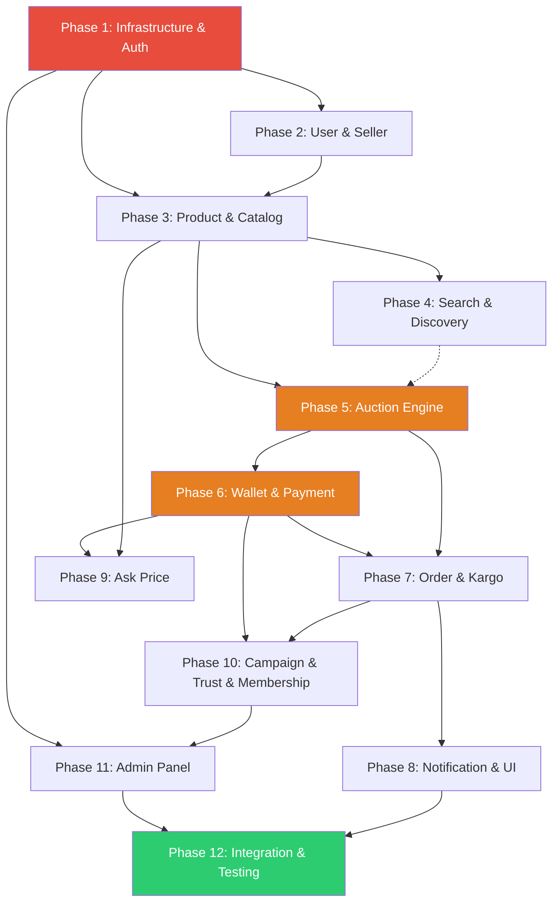

# Execution Order & Dependency Graph

**Date:** 2026-04-07 | **Total:** 12 Phases, 22 Tasks, 222 Requirements

---

## DEPENDENCY GRAPH



---

## CRITICAL PATH

The longest dependency chain determines the minimum project duration:

```
P1 → P2 → P3 → P5 → P6 → P7 → P10 → P11 → P12
 1w    1w   1w   2w   1.5w  1w   1w    1w    1w = 10.5 weeks
```

**Buffer:** 12 weeks available - 10.5 critical path = **1.5 weeks buffer** ✅

---

## PHASE-BY-PHASE EXECUTION ORDER

### WAVE 1 — Foundation (Week 1)

#### Phase 1: Infrastructure & Auth
**Blocks:** Everything
**Parallel:** Nothing — must be first

| Order | Component | What | Blocks |
|-------|----------|------|--------|
| 1.1 | DevOps | Monorepo init, Docker Compose, PostgreSQL, Redis | All backend work |
| 1.2 | DevOps | TASK-20: Environment separation (.env.dev/.staging/.prod) | CI/CD |
| 1.3 | DevOps | TASK-17: Git conventions, CONTRIBUTING.md, PR template | Team workflow |
| 1.4 | Backend | NestJS scaffold, TypeORM config, migrations, Swagger | All modules |
| 1.5 | Backend | Auth module: JWT + refresh token + Passport | All protected endpoints |
| 1.6 | Backend | RBAC guard (user/seller/admin) | All role-based access |
| 1.7 | Backend | Global exception filter, RELY-07/08 | All error handling |
| 1.8 | Backend | SECU-01..04: Helmet, throttler, class-validator | All API security |
| 1.9 | Backend | SECU-06..10: Env vars, SSH key only, rate limit config | Production security |
| 1.10 | Backend | TASK-21: Redis connection with retry + health check | Auction, cache |
| 1.11 | Backend | TASK-18: Security incident process doc | Compliance |
| 1.12 | Backend | INFR-05: Email service setup (doğrulama maili) | Auth verification |
| 1.13 | Backend | Sentry integration (INFR-02) | Error tracking |
| 1.14 | Backend | RELY-13/14: DB pool monitoring, graceful shutdown | Reliability |
| 1.15 | Mobile | Expo project init, Router setup, MMKV | All mobile screens |
| 1.16 | Mobile | Auth screens (login, register, forgot password) | User flows |
| 1.17 | Mobile | TanStack Query + Zustand + API client setup | All data fetching |
| 1.18 | Mobile | RELY-15..19: Error boundary, offline detection, retry | Mobile reliability |
| 1.19 | Process | TASK-16: Demo checklist + biweekly report template | Project management |

**Deliverable:** Register → verify email → login → refresh token → RBAC works
**Duration:** 1 week

---

### WAVE 2 — Core Entities (Week 2-3)

#### Phase 2: User & Seller (Week 2)
**Depends on:** Phase 1 (auth)
**Blocks:** Phase 3 (product needs seller)

| Order | Component | What |
|-------|----------|------|
| 2.1 | Backend | User entity + profile CRUD |
| 2.2 | Backend | Seller entity + user→seller upgrade flow |
| 2.3 | Backend | KVKK consent management + audit log |
| 2.4 | Backend | Account deletion/anonymization |
| 2.5 | Mobile | Profile screens, settings |
| 2.6 | Mobile | Seller registration flow |

**Deliverable:** Login → edit profile → become seller → delete account
**Duration:** 0.5 week

---

#### Phase 3: Product & Catalog (Week 2-3)
**Depends on:** Phase 2 (seller entity)
**Blocks:** Phase 4 (search), Phase 5 (auction), Phase 9 (ask price)
**Can start:** Week 2, day 3 (after seller entity is done)

| Order | Component | What |
|-------|----------|------|
| 3.1 | Backend | Category entity (3-level tree) |
| 3.2 | Backend | Product entity + CRUD |
| 3.3 | Backend | TASK-22: Image upload → Sharp → R2 with retry |
| 3.4 | Backend | Stock management |
| 3.5 | Mobile | Product list, detail, create/edit screens |
| 3.6 | Mobile | Category browser |
| 3.7 | Mobile | Image picker + upload |

**Deliverable:** Seller creates product with images → appears in catalog
**Duration:** 1 week

---

### WAVE 3 — Discovery + Auction (Week 3-5)

#### Phase 4: Search & Discovery (Week 3-4)
**Depends on:** Phase 3 (products to search)
**Blocks:** Nothing critical (soft dependency for Phase 5 listing)
**Can run parallel with:** Phase 5 start

| Order | Component | What |
|-------|----------|------|
| 4.1 | Backend | Search service (3 modes: sales/auction/all) |
| 4.2 | Backend | Filter engine (category, price range, status) |
| 4.3 | Backend | Sort options (price, date, favorites, popularity) |
| 4.4 | Backend | TASK-12: Personalized sort (activity-based) |
| 4.5 | Backend | Favorites CRUD |
| 4.6 | Mobile | Search screen with filters |
| 4.7 | Mobile | Favorites screen |

**Deliverable:** Search → filter → sort → add to favorites
**Duration:** 1 week

---

#### Phase 5: Auction Engine (Week 4-5) ⚠️ CRITICAL
**Depends on:** Phase 3 (product entity), Phase 1 (Redis, Socket.IO)
**Blocks:** Phase 6 (wallet needs bid flow), Phase 7 (order needs auction winner)
**Cannot run parallel with:** Phase 6 (sequential dependency)

| Order | Component | What | Note |
|-------|----------|------|------|
| 5.0 | Design | TASK-01: State machine transition table | **Must complete first** |
| 5.1 | Backend | Auction entity + CRUD | Depends on 5.0 |
| 5.2 | Backend | State machine implementation (guards + transitions) | Depends on 5.0 |
| 5.3 | Backend | TASK-07: WebSocket gateway + event types | Core real-time |
| 5.4 | Backend | Bid service + validation (min increment, balance check) | Depends on 5.3 |
| 5.5 | Backend | TASK-02: Bid idempotency key | Depends on 5.4 |
| 5.6 | Backend | Anti-sniping logic (AUCT-06, 11) | Depends on 5.4 |
| 5.7 | Backend | Redis Pub/Sub adapter for Socket.IO | Multi-instance |
| 5.8 | Backend | TASK-03: Distributed lock for auction end | Depends on 5.7 |
| 5.9 | Backend | BullMQ: auction scheduled jobs (start, end, extend) | Depends on 5.2 |
| 5.10 | Backend | Timed auction variant (AUCT-T-01..04) | Depends on 5.2 |
| 5.11 | Backend | TASK-14: Crash recovery (on bootstrap auction resume) | Depends on 5.9 |
| 5.12 | Backend | AUDT-06: Immutable bid history | Depends on 5.4 |
| 5.13 | Mobile | Auction list screen | Parallel with backend |
| 5.14 | Mobile | Live auction room UI (countdown, bid list, current price) | Depends on 5.3 |
| 5.15 | Mobile | Bid placement UI + optimistic update (RELY-17) | Depends on 5.14 |
| 5.16 | Mobile | WebSocket reconnection (RELY-20, 22) | Depends on 5.14 |
| 5.17 | Mobile | Auction create screen (seller) | Parallel |

**Deliverable:** Create auction → join → bid → anti-snipe → winner determined
**Duration:** 2 weeks (largest phase)

---

### WAVE 4 — Financial System (Week 6-7)

#### Phase 6: Wallet & Payment (Week 6-7) ⚠️ CRITICAL
**Depends on:** Phase 5 (bid flow for wallet hold/release)
**Blocks:** Phase 7 (order needs payment), Phase 9 (ask price needs escrow), Phase 10 (membership needs İyzico)
**Cannot start until:** Phase 5 bid service works

| Order | Component | What | Note |
|-------|----------|------|------|
| 6.1 | Backend | Wallet entity (3-tier: total, held, available) | Foundation |
| 6.2 | Backend | TASK-04: Double-entry ledger schema | **Critical — design first** |
| 6.3 | Backend | TASK-06: Row-level lock wallet service | Depends on 6.1 |
| 6.4 | Backend | Bid → wallet hold integration (connect Phase 5) | Depends on 6.1, 6.3 |
| 6.5 | Backend | Outbid → wallet release | Depends on 6.4 |
| 6.6 | Backend | İyzico payment integration (sandbox) | Independent |
| 6.7 | Backend | Webhook handler + RELY-09 idempotency | Depends on 6.6 |
| 6.8 | Backend | TASK-08: Win → capture → escrow flow | Depends on 6.2, 6.4 |
| 6.9 | Backend | Escrow auto-release (14 days, BullMQ delayed) | Depends on 6.8 |
| 6.10 | Backend | TASK-09: Refund trigger rules | Depends on 6.8 |
| 6.11 | Backend | RELY-12: Circuit breaker (İyzico) | Depends on 6.6 |
| 6.12 | Backend | Seller wallet + commission calculation | Depends on 6.2 |
| 6.13 | Backend | WALL-07/08: Withdrawal request + admin approval | Depends on 6.12 |
| 6.14 | Backend | TASK-10: Reconciliation cron job | Depends on 6.2 |
| 6.15 | Mobile | Wallet screen (balance, transactions) | Parallel |
| 6.16 | Mobile | Payment flow UI | Depends on 6.6 |
| 6.17 | Mobile | Transaction history | Parallel |

**Deliverable:** Load money → bid → win → pay → escrow hold → delivery confirm → seller receives
**Duration:** 1.5 weeks

---

### WAVE 5 — Order & Notification (Week 7-8)

#### Phase 7: Order & Kargo (Week 7-8)
**Depends on:** Phase 5 (auction end → order), Phase 6 (payment → order status)
**Blocks:** Phase 10 (trust needs order history)

| Order | Component | What |
|-------|----------|------|
| 7.1 | Backend | Order entity + state machine |
| 7.2 | Backend | TASK-05: Unique constraint (1 order per auction) |
| 7.3 | Backend | Order lifecycle (ödeme→hazırlık→gönderim→teslim→tamamlanma) |
| 7.4 | Backend | Auto-approve (14 gün, BullMQ delayed) |
| 7.5 | Backend | Next-bidder fallback (admin-approved) |
| 7.6 | Backend | Mock kargo (KARG-01..04, strategy pattern) |
| 7.7 | Backend | Review/Rating (REVW-01..07) |
| 7.8 | Mobile | Order list + detail screens |
| 7.9 | Mobile | Delivery confirmation UI |
| 7.10 | Mobile | Review/Rating screens |
| 7.11 | Mobile | Kargo tracking screen (mock data) |

**Deliverable:** Order created → kargo tracking → delivery confirm → review
**Duration:** 1 week

---

#### Phase 8: Notification & Mobile UI (Week 8) 
**Depends on:** Phase 7 (order status triggers notifications)
**Can run partially parallel with:** Phase 7 (notification infra independent)

| Order | Component | What |
|-------|----------|------|
| 8.1 | Backend | OneSignal integration |
| 8.2 | Backend | Notification template engine (event→message mapping) |
| 8.3 | Backend | In-app notification entity + API |
| 8.4 | Backend | Push retry + in-app fallback (NOTF-07) |
| 8.5 | Backend | Notification preferences API |
| 8.6 | Mobile | Push notification handler + deep linking |
| 8.7 | Mobile | In-app notification center |
| 8.8 | Mobile | Profile menu polish (MUIX-01..04) |
| 8.9 | Mobile | Notification settings screen |

**Deliverable:** Bid outbid → push notification → tap → auction screen
**Duration:** 1 week

---

### WAVE 6 — Business Features (Week 9-10)

#### Phase 9: Ask Price (Week 9)
**Depends on:** Phase 6 (escrow for accepted offer), Phase 3 (product entity)
**Can run parallel with:** Phase 10 (independent features)

| Order | Component | What |
|-------|----------|------|
| 9.1 | Backend | AskPrice listing mode (price hidden) |
| 9.2 | Backend | Chat entity + real-time messaging (Socket.IO) |
| 9.3 | Backend | Platform dışı yönlendirme keyword filter (ASKP-04) |
| 9.4 | Backend | Offer entity (satıcı fiyat bildirimi, geçerlilik süresi) |
| 9.5 | Backend | Accept → auto escrow (ASKP-06) |
| 9.6 | Backend | ASKP-08: Auction + AskPrice conflict check |
| 9.7 | Backend | IP/device ban mechanism (ASKP-10/11) |
| 9.8 | Mobile | AskPrice listing create screen |
| 9.9 | Mobile | Chat UI |
| 9.10 | Mobile | Offer accept/reject UI |

**Deliverable:** Create "Fiyat Sor" listing → chat → offer → accept → escrow
**Duration:** 1 week

---

#### Phase 10: Campaign, Trust, Membership (Week 10)
**Depends on:** Phase 6 (wallet for payments), Phase 7 (order for trust scoring)
**Can run parallel with:** Phase 9

| Order | Component | What |
|-------|----------|------|
| 10.1 | Backend | Campaign/discount engine (CAMP-01..06) |
| 10.2 | Backend | Coupon system |
| 10.3 | Backend | Ads module (ADS-01..06) with admin approval |
| 10.4 | Backend | TASK-11: Trust scoring algorithm |
| 10.5 | Backend | Multi-account detection (TRST-04) |
| 10.6 | Backend | TASK-13: Membership tiers + İyzico recurring |
| 10.7 | Mobile | Campaign/coupon UI |
| 10.8 | Mobile | "Paketim" membership screen |
| 10.9 | Mobile | Trust badge/score display |

**Deliverable:** Apply coupon → discount → commission correct. Upgrade membership → lower commission.
**Duration:** 1 week

---

### WAVE 7 — Admin & Polish (Week 11)

#### Phase 11: Admin Panel (Week 11)
**Depends on:** Phase 10 (all backend APIs must exist)
**Blocks:** Phase 12 (admin E2E tests)

| Order | Component | What |
|-------|----------|------|
| 11.1 | Admin | Vue 3 + Vite + PrimeVue scaffold |
| 11.2 | Admin | Auth + RBAC (super admin / admin) |
| 11.3 | Admin | User/Seller management CRUD |
| 11.4 | Admin | Product management |
| 11.5 | Admin | Auction management + TASK-15: Override actions |
| 11.6 | Admin | Order/Payment management |
| 11.7 | Admin | Wallet/Withdrawal approval |
| 11.8 | Admin | Campaign/Ads management |
| 11.9 | Admin | Membership plan management |
| 11.10 | Admin | Real-time dashboard (Socket.IO) |
| 11.11 | Admin | Audit log viewer (AUDT-07) |
| 11.12 | Admin | Review/Comment moderation |

**Deliverable:** Full admin panel with all management + dashboard
**Duration:** 1 week

---

### WAVE 8 — Final (Week 12 + Buffer)

#### Phase 12: Integration & Testing (Week 12)
**Depends on:** All phases
**Blocks:** Go-live

| Order | Component | What |
|-------|----------|------|
| 12.1 | DevOps | CI/CD pipeline finalize (GitHub Actions) |
| 12.2 | DevOps | Production Docker Compose + Caddy config |
| 12.3 | Testing | Security tests (SQLi, XSS, CSRF, rate limit) |
| 12.4 | Testing | Load test: 10K concurrent users (k6) |
| 12.5 | Testing | Load test: 5K WS connections |
| 12.6 | Testing | Load test: 1K bids/10s stress |
| 12.7 | Testing | E2E tests (mobile + admin) |
| 12.8 | Testing | Contract tests (mobile↔backend) |
| 12.9 | Testing | All smoke + regression suite |
| 12.10 | Mobile | TASK-19: App Store preparation |
| 12.11 | DevOps | Production deploy + monitoring |
| 12.12 | Process | Handoff checklist completion |

**Deliverable:** Production-ready, tested, documented, submitted to stores
**Duration:** 1 week + tampon

---

## PARALLELIZATION MAP

```
Week  1: ████████████████████████████████████ P1 (full width — blocker)
Week  2: ██████████ P2 ││████████████████████ P3 starts mid-week
Week  3: ████████████████████ P3 completes ││ P4 starts
Week  4: ██████████ P4  ││████████████████████ P5 starts (overlaps P4 end)
Week  5: ████████████████████████████████████ P5 continues (2 week phase)
Week  6: ████████████████████████████████████ P6 (sequential after P5)
Week  7: ██████████████ P6 end ││███████████ P7 starts
Week  8: ██████████ P7  ││████████████████████ P8 parallel
Week  9: ██████████ P9  ││████████████████████ P10 parallel
Week 10: ████████████████████ P10 completes
Week 11: ████████████████████████████████████ P11
Week 12: ████████████████████████████████████ P12
Buffer : ████████ tampon ██████ stabilizasyon
```

### Parallel Opportunities:
| Weeks | Parallel Pair | Why Safe |
|-------|-------------|----------|
| W2-3 | P2 → P3 | P3 only needs seller entity from P2 (ready day 2) |
| W3-4 | P4 ∥ P5 start | Search doesn't block auction, auction doesn't need search |
| W7-8 | P7 || P8 backend | Notification service is independent from order logic |
| W9-10 | P9 ∥ P10 | Ask Price and Campaign/Trust are independent features |

### Sequential Musts (NO parallel):
| Pair | Why |
|------|-----|
| P1 → everything | Auth, DB, Redis needed by all |
| P5 → P6 | Wallet hold/release depends on bid service |
| P6 → P7 | Order creation depends on payment capture |
| P6 → P9 | Ask Price escrow depends on payment system |
| P10 → P11 | Admin panel consumes all backend APIs |
| P11 → P12 | E2E tests need admin panel |

---

## DEADLOCK ANALYSIS

### Potential Circular Dependencies — NONE FOUND ✅

Checked for:
| Check | Result |
|-------|--------|
| P5 (Auction) needs P6 (Wallet)? | ❌ No — P5 only defines bid interface; P6 implements wallet hold |
| P6 (Wallet) needs P5 (Auction)? | ✅ Yes — P6 connects wallet hold to bid flow |
| Circular? | ❌ No — P5 creates bid records with `walletHoldAmount` field. P6 adds the actual hold logic. P5 can run with mock wallet in tests. |

Resolution strategy:
1. **Phase 5:** Build bid service with `IWalletService` interface (mock in tests)
2. **Phase 6:** Implement `WalletService` that satisfies `IWalletService`
3. **Phase 6 end:** Integration test connects real bid → real wallet hold

### Other Checked Pairs:
| Pair | Risk | Status |
|------|------|--------|
| Auction ↔ Order | Auction end creates order | ✅ One-way: P5 → P7 |
| Wallet ↔ Payment | Payment fills wallet | ✅ One-way: PAY fills WALL |
| Notification ↔ All | Many events trigger notifs | ✅ One-way: Events → NOTF |
| Admin ↔ Backend | Admin reads/writes backend | ✅ One-way: Admin → API |
| Membership ↔ Wallet | Membership deducts wallet | ✅ One-way: MEMB calls WALL |

**Verdict: Zero circular dependencies. No deadlock risk.** ✅

---

## TASK ↔ PHASE MAPPING

| Task | Phase | Build Order Position |
|------|-------|---------------------|
| TASK-16,17,18,20,21 | Phase 1 | Week 1 |
| TASK-22 | Phase 3 | Week 2-3 |
| TASK-12 | Phase 4 | Week 3-4 |
| TASK-01 (design) | Pre-Phase 5 | Week 3 (design during P4) |
| TASK-02,03,07,14 | Phase 5 | Week 4-5 |
| TASK-04,06,08,09,10 | Phase 6 | Week 6-7 |
| TASK-05 | Phase 7 | Week 7-8 |
| TASK-11,13 | Phase 10 | Week 9-10 |
| TASK-15 | Phase 11 | Week 11 |
| TASK-19 | Phase 12 | Week 12 |

---

## BUILD ORDER CHECKLIST

```
[ ] Week 1  — P1: Auth + Infra + DevOps setup
[ ] Week 2  — P2: User/Seller + P3 start
[ ] Week 3  — P3: Product/Catalog + P4 start + TASK-01 design
[ ] Week 4  — P4: Search + P5 start (auction backend)
[ ] Week 5  — P5: Auction complete (WS, anti-snipe, state machine)
[ ] Week 6  — P6: Wallet/Payment start (ledger, İyzico)
[ ] Week 7  — P6: Wallet end + P7 start (order, kargo)
[ ] Week 8  — P7 + P8 parallel (notification)
[ ] Week 9  — P9 + P10 parallel (ask price, campaign)
[ ] Week 10 — P10 complete (trust, membership)
[ ] Week 11 — P11: Admin panel
[ ] Week 12 — P12: Testing + deploy + store
[ ] Buffer  — Stabilization + handoff
```

---
*Created: 2026-04-07*
*Critical path: 10.5 weeks (1.5w buffer)*
*Deadlock check: PASSED*
*Parallel opportunities: 4 pairs identified*
