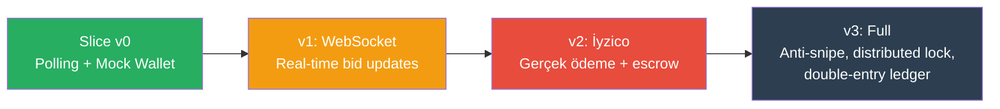

# Vertical Slice v0 — İlk Çalışan Uçtan Uca Akış

**Hedef:** Kullanıcı login olur → ürün görür → teklif verir → sonucu görür  
**Süre:** 2-3 hafta  
**Kapsam dışı:** Real-time WS, ödeme entegrasyonu, gelişmiş özellikler

---

## Kullanıcı Hikayesi

```
1. Kullanıcı uygulamayı açar
2. Login olur (email + şifre)
3. Ana sayfada ürünleri/müzayedeleri görür
4. Bir müzayedeye tıklar → detay sayfası açılır
5. Teklif verir (bakiye kontrolü + mock wallet)
6. "Teklifiniz alındı" onayı görür
7. Müzayede listesinde güncel teklif fiyatı güncellenir (polling)
8. Müzayede süresi bitince sonuç görünür (kazandı/kaybetti)
```

---

## Mimari Kararlar (Sadece Slice İçin)

| Karar | Slice v0 | Production (sonra) |
|-------|----------|-------------------|
| Real-time | ❌ HTTP polling (5sn) | WebSocket + Redis Pub/Sub |
| Wallet | Mock: her kullanıcıya 10.000₺ başlangıç | İyzico + double-entry ledger |
| Payment | ❌ Yok | İyzico escrow |
| Image upload | Local disk / static URL | CloudFlare R2 + Sharp |
| Auction end | BullMQ delayed job | BullMQ + distributed lock |
| Anti-snipe | ❌ Yok | Redis timestamp check |
| State machine | Basitleştirilmiş (3 durum) | Full 6-state FSM |
| Push notification | ❌ Yok | OneSignal |
| Admin panel | ❌ Yok (Swagger yeterli) | Vue.js admin |

---

## Teknik Scope

### Backend (NestJS)

#### 1. Auth (Phase 1'den — zaten planlandı)
- POST /auth/register → kullanıcı oluştur
- POST /auth/login → JWT token dön
- JWT guard → tüm API'leri koru

**Basitleştirme:** Email doğrulama skip, refresh token skip (sadece access token)

#### 2. Product Module (YENİ — minimal)
```
Entity: Product
  - id, title, description, price, imageUrl (static), 
  - sellerId, categoryId (nullable), 
  - status (ACTIVE/INACTIVE), createdAt

Endpoints:
  POST   /products          → Ürün oluştur (seller)
  GET    /products          → Ürün listele (herkes)
  GET    /products/:id      → Ürün detay
```

**Basitleştirme:** 
- Görsel upload yok → `imageUrl` elle girilir veya seed data
- Kategori sistemi yok → düz liste
- Stok yok → sadece listelenme

#### 3. Auction Module (YENİ — minimal)
```
Entity: Auction
  - id, productId, sellerId
  - startPrice (decimal 12,2)
  - currentPrice (decimal 12,2)
  - minIncrement (decimal 12,2, default: 1.00)
  - status: PENDING | ACTIVE | ENDED
  - startTime, endTime
  - winnerId (nullable)
  - createdAt

Entity: Bid
  - id, auctionId, bidderId
  - amount (decimal 12,2)
  - createdAt

Endpoints:
  POST   /auctions                → Müzayede oluştur (seller)
  GET    /auctions                → Aktif müzayedeleri listele
  GET    /auctions/:id            → Müzayede detay (currentPrice, bids, timeLeft)
  POST   /auctions/:id/bids       → Teklif ver
  GET    /auctions/:id/bids       → Teklif geçmişi
  GET    /auctions/:id/result     → Sonuç (kazanan, final fiyat)
```

**Bid Validation (basitleştirilmiş):**
```typescript
async placeBid(auctionId: string, bidderId: string, amount: number) {
  // 1. Müzayede ACTIVE mi?
  const auction = await this.auctionRepo.findOne({ where: { id: auctionId } });
  if (auction.status !== 'ACTIVE') throw new BadRequestException('Müzayede aktif değil');
  if (new Date() > auction.endTime) throw new BadRequestException('Müzayede sona erdi');
  
  // 2. Teklif >= currentPrice + minIncrement mı?
  if (amount < auction.currentPrice + auction.minIncrement) 
    throw new BadRequestException(`Minimum teklif: ${auction.currentPrice + auction.minIncrement}`);
  
  // 3. Bakiye yeterli mi? (mock wallet check)
  const wallet = await this.walletService.getBalance(bidderId);
  if (wallet.available < amount) 
    throw new BadRequestException('Yetersiz bakiye');
  
  // 4. Önceki hold'u serbest bırak, yeni hold oluştur
  await this.walletService.releaseHold(auctionId, bidderId);
  await this.walletService.createHold(auctionId, bidderId, amount);
  
  // 5. Bid oluştur, currentPrice güncelle
  const bid = this.bidRepo.create({ auctionId, bidderId, amount });
  await this.bidRepo.save(bid);
  auction.currentPrice = amount;
  await this.auctionRepo.save(auction);
  
  return bid;
}
```

#### 4. Mock Wallet Service (YENİ — minimal)
```
Entity: Wallet
  - id, userId
  - balance (decimal 12,2, default: 10000.00)
  - heldAmount (decimal 12,2, default: 0)

Entity: WalletHold
  - id, walletId, auctionId, userId, amount
  - status: HELD | RELEASED

Endpoints:
  GET    /wallet/balance          → Bakiye sorgula
  GET    /wallet/holds            → Aktif hold'ları listele

Service Methods (internal):
  getBalance(userId)              → { balance, held, available }
  createHold(auctionId, userId, amount)  → bakiyeden düş, hold oluştur
  releaseHold(auctionId, userId)  → hold'u serbest bırak
  captureHold(auctionId, userId)  → kazanan hold'u kesinleştir (bakiyeden sil)
```

**Basitleştirme:**
- Para yükleme yok → herkes 10.000₺ ile başlar
- Double-entry ledger yok → basit balance update
- İyzico yok → tamamen mock

#### 5. Auction Scheduler (BullMQ — minimal)
```typescript
// Müzayede oluşturulduğunda:
await this.auctionQueue.add('start-auction', { auctionId }, { 
  delay: startTime - Date.now() 
});
await this.auctionQueue.add('end-auction', { auctionId }, { 
  delay: endTime - Date.now() 
});

// Worker:
@Processor('auction')
export class AuctionProcessor {
  @Process('start-auction')
  async handleStart(job) {
    await this.auctionService.activateAuction(job.data.auctionId);
  }
  
  @Process('end-auction')
  async handleEnd(job) {
    const auction = await this.auctionService.finalizeAuction(job.data.auctionId);
    // Kazananın hold'unu capture et, kaybedenlerin hold'unu release et
  }
}
```

---

### Mobile (React Native / Expo)

#### Ekranlar (minimal, işlevsel)

```
(auth)/
  ├── login.tsx              → Email + password → login

(tabs)/
  ├── _layout.tsx            → 3 tab: Home, Auctions, Profile
  ├── index.tsx              → Ürün listesi (FlashList)
  ├── auctions.tsx           → Aktif müzayede listesi
  └── profile.tsx            → Wallet bakiye + basit profil

(stack)/
  ├── product/[id].tsx       → Ürün detay
  ├── auction/[id].tsx       → Müzayede detay + teklif verme
  └── auction/[id]/result.tsx → Müzayede sonucu
```

#### Müzayede Detay Ekranı (core UX)
```
┌─────────────────────────┐
│  [Ürün Görseli]          │
│  iPhone 15 Pro           │
│  ─────────────────────── │
│  Güncel Fiyat: 15.250₺   │
│  Kalan Süre: 02:15:30    │
│  ─────────────────────── │
│  Min. Teklif: 15.350₺    │
│                          │
│  [  15.350  ] [TEKLİF VER]│
│  ─────────────────────── │
│  Son Teklifler:          │
│  • 15.250₺ - user@...    │
│  • 15.100₺ - user2@...   │
│  • 15.000₺ - user3@...   │
└─────────────────────────┘
```

**Polling:** `useQuery` ile 5 saniyede bir `GET /auctions/:id` → `refetchInterval: 5000`

#### Profil Ekranı (mock wallet)
```
┌─────────────────────────┐
│  Cüzdanım               │
│  ─────────────────────── │
│  Bakiye:    10.000₺      │
│  Hold:       1.500₺      │
│  Kullanılabilir: 8.500₺  │
│  ─────────────────────── │
│  [Çıkış Yap]            │
└─────────────────────────┘
```

---

## Haftalık Plan

### Hafta 1: Backend Foundation + Auth + Product
| Gün | Backend | Mobile |
|-----|---------|--------|
| P | NestJS scaffold, Docker, PostgreSQL, Redis | Expo init, navigation |
| S | Auth module (register, login, JWT guard) | Login ekranı + API client |
| Ç | Product entity + CRUD endpoints | Product list + detail ekranları |
| P | Swagger, seed data (10 ürün) | API entegrasyonu (products) |
| C | Backend tests (auth + product) | Auth flow test |

**Hafta 1 Demo:** Login → ürün listesi → ürün detay

### Hafta 2: Auction + Wallet + Bid
| Gün | Backend | Mobile |
|-----|---------|--------|
| P | Auction entity + CRUD + basit state machine | Auction list ekranı |
| S | Bid service + validation + wallet hold | Auction detail ekranı |
| Ç | Mock wallet service (balance, hold, release) | Bid verme UI + polling |
| P | BullMQ scheduler (start/end auction jobs) | Wallet/profile ekranı |
| C | Auction finalize + winner + hold capture | Sonuç ekranı |

**Hafta 2 Demo:** Müzayede oluştur (Swagger) → bid ver → süre dolunca sonuç gör

### Hafta 3 (Buffer): Polish + Seed + Test
| Gün | Odak |
|-----|------|
| P | Seed data: 5 kullanıcı, 10 ürün, 3 aktif müzayede |
| S | Error handling + edge cases (süresi dolmuş, bakiye yetmez) |
| Ç | Mobile UI polish (loading, empty states, error states) |
| P | E2E test: register → login → bid → result |
| C | İlk demo sunumu |

---

## Seed Data (Demo İçin)

```sql
-- Users (şifre: Test1234!)
INSERT INTO users (email, "passwordHash", "firstName", role, "isVerified")
VALUES 
  ('buyer1@test.com', '$2b...', 'Ahmet', 'user', true),
  ('buyer2@test.com', '$2b...', 'Mehmet', 'user', true),
  ('seller1@test.com', '$2b...', 'Fatma', 'seller', true);

-- Products (seller1 tarafından)
INSERT INTO products (title, description, price, "imageUrl", "sellerId", status)
VALUES
  ('iPhone 15 Pro', '256GB Space Black', 45000, 'https://placehold.co/400x400?text=iPhone', seller1_id, 'ACTIVE'),
  ('MacBook Air M3', '8GB RAM 256GB SSD', 38000, 'https://placehold.co/400x400?text=MacBook', seller1_id, 'ACTIVE'),
  ('AirPods Pro 2', 'USB-C', 7500, 'https://placehold.co/400x400?text=AirPods', seller1_id, 'ACTIVE');

-- Wallets (herkes 10.000₺)
INSERT INTO wallets ("userId", balance, "heldAmount")
VALUES (buyer1_id, 10000, 0), (buyer2_id, 10000, 0);

-- Auction (1 saat sonra biter)
INSERT INTO auctions ("productId", "sellerId", "startPrice", "currentPrice", "minIncrement", status, "startTime", "endTime")
VALUES (iphone_id, seller1_id, 10000, 10000, 100, 'ACTIVE', NOW(), NOW() + INTERVAL '1 hour');
```

---

## Başarı Kriterleri (Vertical Slice v0)

```
[x] Login çalışıyor
[x] Ürün listesi yükleniyor  
[x] Ürün detay açılıyor
[x] Aktif müzayedeler listeleniyor
[x] Müzayede detayında güncel fiyat görünüyor
[x] Teklif verilebiliyor (validasyon: min increment + bakiye check)
[x] Teklif sonrası fiyat güncelleniyor (polling)
[x] Bakiye hold mekanizması çalışıyor
[x] Outbid olunca hold release ediliyor
[x] Müzayede süresi dolunca otomatik kapanıyor
[x] Kazanan belirleniyor
[x] Kazananın hold'u capture ediliyor
[x] Sonuç ekranı çalışıyor
```

---

## Mevcut Planlarla İlişki

| Mevcut Plan | Vertical Slice İçin | Değişiklik |
|-------------|---------------------|-----------|
| 01-01-PLAN (Backend) | ✅ Aynen kullanılır | Email verify skip, refresh token defer |
| 01-02-PLAN (Mobile) | ✅ Aynen kullanılır | 5 tab → 3 tab |
| 01-03-PLAN (Admin) | ❌ Defer | Admin panel Hafta 11'e |
| Phase 2 (User/Seller) | Minimal seller role | Sadece role enum |
| Phase 3 (Product) | Minimal entity + CRUD | No image upload, no category tree |
| Phase 4 (Search) | ❌ Defer | Basit GET /products yeterli |
| Phase 5 (Auction) | Minimal (3 state, no WS) | Polling, no anti-snipe |
| Phase 6 (Wallet) | Mock wallet | No İyzico, no ledger |

---

## Slice'dan Production'a Geçiş Yolu



| Aşama | Ne eklenir | Süre |
|-------|-----------|------|
| v0 → v1 | Socket.IO gateway, Redis Pub/Sub, live countdown | +1 hafta |
| v1 → v2 | İyzico sandbox, real wallet, escrow flow | +1.5 hafta |
| v2 → v3 | State machine (6 state), anti-snipe, distributed lock, ledger | +1 hafta |

---

*Created: 2026-04-07*
*Timeline: 2-3 weeks*
*Core value demonstrated: Login → See Product → Place Bid → See Result*
